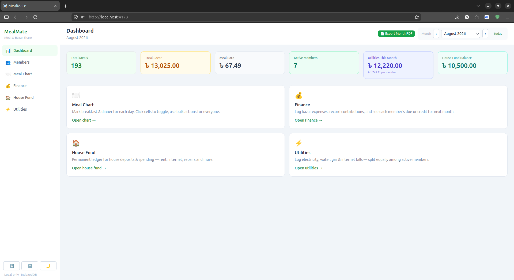
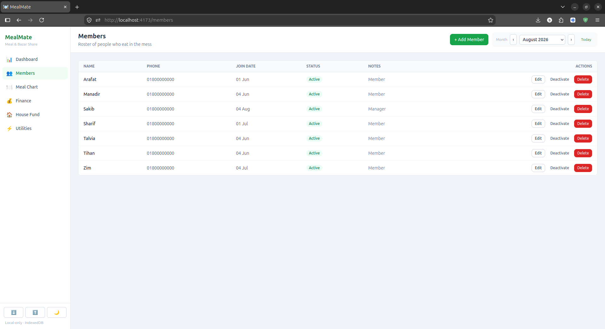
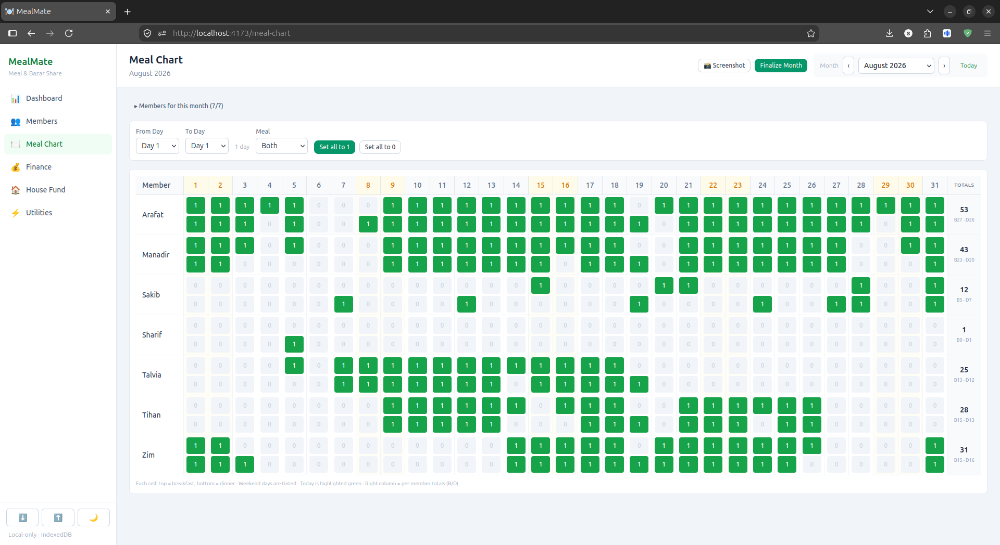
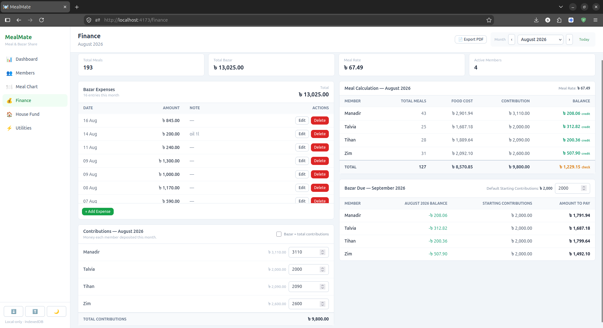
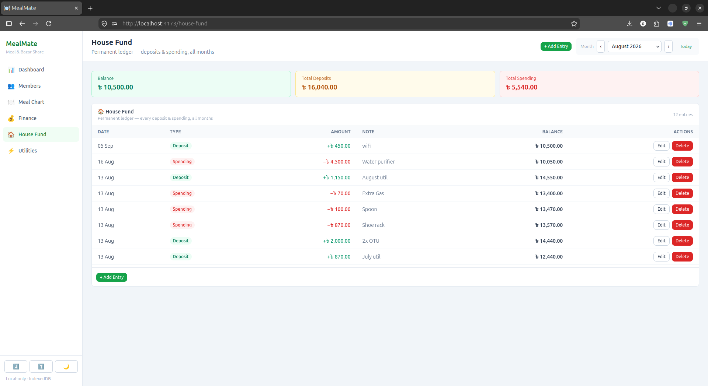
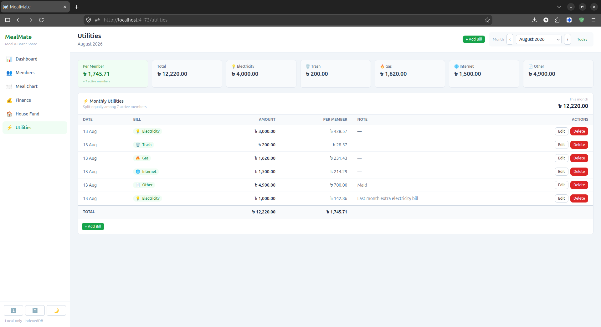

<div align="center">

# 🍽️ MealMate

*A local-first, offline web app for managing shared meals, bazar expenses, house fund, and utilities*


</div>

---

# About

MealMate is a local-first web app for managing shared meals and bazar expenses in a shared living space (mess, hostel, flat, etc.). It helps you track who ate how many meals, log what the bazar cost, settle individual dues, and keep an eye on the house fund and shared utility bills.

Everything runs entirely offline in your browser — data lives in IndexedDB, with no server, no login, and no account. It was built for personal use managing my own flat (replacing an earlier Flutter app) and is mature enough to use as-is or fork.

# Features

| Feature | Description |
|---------|-------------|
| **Member Management** | Add, edit, deactivate, or remove members without losing their history. |
| **Meal Chart** | Click-to-toggle daily meal entries on a month-view grid. Bulk-set a day/meal for everyone at once, exclude a member for a month, and finalize a month to lock it in. |
| **Finance Tracking** | Log bazar expenses and record each member's monthly contribution. |
| **House Fund** | Track the shared fund — deposits, balances, and who is owed what. |
| **Utilities** | Record monthly utility bills (electricity, gas, trash, water) and how they're shared. |
| **Automatic Calculations** | Meal rate, individual dues/credits, monthly summaries, and next month's due are all computed live — no manual math. |
| **Export** | Download a month's meal chart and financial summary as a PDF, or grab a quick screenshot of any table. |
| **Backup & Restore** | Export the whole database to a JSON file and restore it later. |
| **Offline-First** | Everything lives in the browser via IndexedDB. No server, no internet connection required after first load. |
| **Error Resilient** | Wrapped in React error boundaries, so one broken component doesn't crash the whole app. |

# Project Structure

```text
MealMate/
├── mealmate-linux.sh            # One-click launcher (Linux) — no Node needed
├── mealmate-windows.bat         # One-click launcher (Windows) — no Node needed
├── screenshots/                 # Screens shown in this README
├── public/                      # Static assets
├── src/
│   ├── components/
│   │   ├── common/              # Shared UI (Button, Modal, Table, …)
│   │   ├── finance/             # Bazar expense & summary tables
│   │   ├── funds/               # House Fund & Utilities
│   │   ├── layout/              # Header, Sidebar, MonthSelector
│   │   ├── mealchart/           # Meal Chart grid & bulk actions
│   │   └── members/             # Member list & form
│   ├── context/                 # Global state
│   ├── db/                      # Dexie (IndexedDB) schema
│   ├── hooks/                   # Data hooks (members, meals, finance…)
│   ├── pages/                   # One page per feature
│   └── utils/                   # Calculations, export, backup
├── index.html
├── package.json
├── tailwind.config.js
└── LICENSE
```

# Screens

| Dashboard | Members | Meal Chart |
|-----------|---------|------------|
|  |  |  |

| Finance | House Fund | Utilities |
|---------|------------|-----------|
|  |  |  |

## Getting Started

### Prerequisites

To just run the app, **nothing needs to be installed** — the launcher scripts download a local Node.js on first run (no admin rights, no system changes).

To build from source you'll need:

- **Node.js** 20+ (tested with v22/v24)
- **npm** 10+

### Run without Node or a terminal (recommended)

The launcher scripts build the app, start it, and open it in your browser — no terminal and no manual install needed.

**Windows:** double-click [`mealmate-windows.bat`](mealmate-windows.bat).

**Linux:** right-click → *Run as Program*, or run it from a terminal.

```bash
chmod +x mealmate-linux.sh   # only needed once after downloading
./mealmate-linux.sh          # start the app
./mealmate-linux.sh stop     # shut it down
```

No `chmod` needed if you prefer `bash mealmate-linux.sh`.

The app opens at [http://127.0.0.1:4173](http://127.0.0.1:4173).

### Run from source

```bash
git clone https://github.com/SakibHasanMD/MealMate.git
cd MealMate
npm install
npm run dev
```

Open [http://localhost:5173](http://localhost:5173) to view the app in your browser.

### Production build

```bash
npm run build
npm run preview
```

`npm run build` outputs a production build to `dist/`; `npm run preview` serves it locally.

## License

This project is licensed under the **MIT License** — see the [LICENSE](LICENSE) file for details.